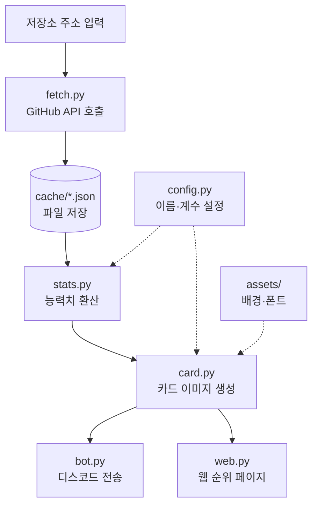

# Git Reward 로직도

팀원 설명용 문서. 코드를 몰라도 흐름은 이해할 수 있게 정리했다.

---

## 1. 전체 흐름 — 한눈에

```
┌─────────────────────────────────────────────────────┐
│                    GitHub                            │
│         (우리 팀 저장소에 쌓인 커밋 기록)              │
└────────────────────────┬────────────────────────────┘
                         │  ① 저장소 주소로 요청
                         ▼
                   ┌───────────┐
                   │ fetch.py  │  기록을 받아온다
                   └─────┬─────┘
                         │  ② 사람별 숫자 4개
                         ▼
                 ┌───────────────┐
                 │ cache/*.json  │  파일로 저장
                 └───────┬───────┘
                         │  ③ 저장된 숫자를 읽어서
                         ▼
                   ┌───────────┐
                   │ stats.py  │  능력치로 환산
                   └─────┬─────┘
                         │  ④ ATK / DEF / AGI / STA + 레벨
                         ▼
                   ┌───────────┐
                   │  card.py  │  카드 그림을 그린다
                   └─────┬─────┘
                         │  ⑤ PNG 이미지
                 ┌───────┴───────┐
                 ▼               ▼
           ┌──────────┐    ┌──────────┐
           │  bot.py  │    │  web.py  │
           │ 디스코드  │    │  웹 순위  │
           └──────────┘    └──────────┘
```

---

## 2. 단계별로 무슨 일이 일어나나

### ① 저장소 주소를 넣는다

```
https://github.com/팀계정/우리레포
```

### ② GitHub이 사람별 숫자를 준다

| 아이디 | 커밋 | 추가한 줄 | 삭제한 줄 | 활동 주 |
|---|---|---|---|---|
| hong | 42 | 1,203 | 456 | 9 |
| kim | 18 | 640 | 210 | 6 |

> GitHub에는 "수정"이라는 항목이 없다. 한 줄을 고치면 **삭제 1 + 추가 1**로 계산된다.

### ③ 파일로 저장한다

받아온 숫자를 JSON 파일에 저장한다. 두 가지 이유가 있다.

- **속도** — 다시 요청하지 않고 파일만 읽으면 된다
- **안전** — 시연장 와이파이가 끊겨도 저장된 파일로 데모가 돌아간다

### ④ 숫자를 능력치로 바꾼다

```
추가한 줄 1,203  ÷ 50  →  ATK 24
삭제한 줄   456  ÷ 50  →  DEF  9
커밋       42  × 2   →  AGI 84
활동 주      9  × 5   →  STA 45

레벨 = (24 + 9 + 84 + 45) ÷ 8 = Lv.20
```

조정하는 숫자는 임시값이다. 여러 저장소를 넣어보며 **레벨이 20~50 사이**에 오도록 맞춘다.

### ⑤ 카드 그림을 그린다

```
┌──────────────────────┐
│   ●  hong            │   ← 프로필 사진 + 아이디
│      Lv. 20          │
│                      │
│   ATK  ████░░░░  24  │
│   DEF  ██░░░░░░   9  │
│   AGI  ████████  84  │
│   STA  ██████░░  45  │
└──────────────────────┘
```

### ⑥ 두 곳으로 나간다

- **디스코드** — 채널에서 명령어를 입력하면 카드가 바로 올라온다
- **웹** — 팀 전체 카드를 순위대로 나열한다

---

## 3. 누가 뭘 건드리나

```
config.py  ──── 능력치 이름, 계수, 색상          [설정 담당]
fetch.py   ──── GitHub에서 데이터 받아오기        [데이터 담당]
stats.py   ──── 숫자를 능력치로 환산              [밸런스 담당]
card.py    ──── 카드 이미지 그리기                [디자인 담당]
bot.py     ──── 디스코드 명령 처리                [봇 담당]
web.py     ──── 순위 페이지                       [웹 담당]
assets/    ──── 카드 배경 그림, 폰트              [디자인 담당]
```

**한 파일은 한 사람만 수정한다.** 이 규칙만 지키면 서로 코드가 충돌할 일이 없다.

---

## 4. 파일 사이의 약속

각 파일은 서로의 **내부 코드를 몰라도** 된다. 주고받는 데이터 형태만 지키면 된다.

```
fetch.py  ──[ 아래 형태 ]──▶  stats.py

{
  "login":        "hong",
  "avatar":       "https://...",
  "commits":      42,
  "additions":    1203,
  "deletions":    456,
  "active_weeks": 9
}
```

**이 형태는 바꾸지 않는다.** 바꿔야 할 일이 생기면 혼자 고치지 말고 팀에 먼저 알린다. 여기가 어긋나면 모든 파일이 동시에 멈춘다.

---

## 5. Mermaid 버전

GitHub에서는 아래 코드가 그림으로 보인다.



---

## 6. 이번에 안 하는 것

만들다 보면 넣고 싶어지지만, 시간을 가장 많이 잡아먹으면서 결과물에는 거의 기여하지 않는 것들이다.

- 로그인 / 회원가입
- 데이터베이스
- 실시간 자동 갱신
- 던전, 아이템 등 게임 시스템
- 서버 배포

**카드 결투**는 확장 예정이다. 카드 두 장을 나란히 놓는 자리까지만 준비해두고, 승패 규칙은 이후에 정한다.
